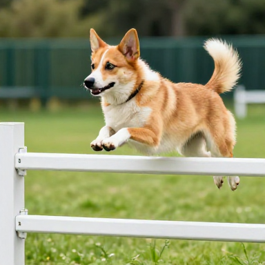
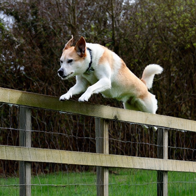

# offgrid


Your personal LLM bunker. One portable binary that downloads language models,
runs them, chats with them, codes with them, and serves them to other tools.
All of it on your own machine, all of it offline once the models are on disk.

No external dependencies. No model server to install, no Python environment to
ruin, no cloud, no accounts, no telemetry. llama.cpp is compiled straight into
the executable, the fonts and icons are baked in, and the whole thing fits in
a single file you can copy onto a USB stick next to your canned beans. When
the internet goes away, offgrid keeps working. Frankly, it barely noticed the
internet was there in the first place.

## What it does

- **Models**: a curated catalog of known-good models plus full Hugging Face
  search. Every model shows its size, an estimated tok/s for your actual
  hardware (measured, not guessed from vibes), and a fit badge saying where it
  would run — in RAM, or entirely on your graphics card — before you commit to
  an 18 GB download. Downloads
  survive network drops and app restarts, and resume where they stopped.
- **Chat**: streaming markdown chat with whatever model you loaded. Reasoning
  models get their thinking rendered as a quiet little quote block instead of
  raw tags all over your screen. An optional **🌐 Web** toggle lets the model
  search the web before answering — the same `web_search`/`fetch_url` tools the
  coding agent uses, run as a quick pre-pass whose results are folded into the
  answer, so a small local model can ground itself in current facts instead of
  guessing. Off by default, because a search query is the one thing that leaves
  your machine; when the model can answer from memory it simply does, and when
  the web is unreachable it falls back to answering offline.
- **Code**: a small coding agent in the spirit of Claude Code, just with a
  model that fits in your laptop. Point it at a folder, give it a task, and it
  reads, writes, and runs things in a tool loop. File access is sandboxed to
  the workspace, shell commands wait for your approval unless you tell it to
  stop asking. Drop an `AGENTS.md` into the workspace for project
  instructions. Optional web tools (search and page fetch) are off by default
  and fail politely when offline, which is the entire point of this app. A run
  that is stopped or killed leaves its transcript behind, so a **Resume**
  button picks it up where it left off instead of starting over.
- **Serve**: an OpenAI-compatible API on `127.0.0.1:11633`, so opencode,
  aider, editors, and scripts can use your local models while believing they
  are talking to something much more expensive. `POST /v1/chat/completions`
  accepts an offgrid-specific `"web": true` field (streamed or not) that runs
  the same search-before-you-answer pre-pass as the Chat tab; a client that
  cannot add custom fields can instead start offgrid with `OFFGRID_WEB=1` to
  default it on for every completion (and still send `"web": false` to opt a
  request out). An opt-in "Allow LAN access"
  mode binds 0.0.0.0 and adds remote-control endpoints: `GET /logs` +
  `GET /logs/latest` (agent session logs), `POST /agent` (start a run:
  `{"task": "...", "workspace": "...", "web_tools": true}`, always
  auto-approve), `GET /agent` (status, including a `note` with the last nudge or
  compaction and an `outcome` once the run ended), `POST /agent/stop`,
  `GET /agent/saved` + `POST /agent {"resume": true}` (continue an
  interrupted run), `POST /agent/say {"text": "..."}` (steer a running one). Only enable it on
  a network where you trust every device — remote runs execute shell
  commands.
  There is also an optional **Telegram bridge**: paste a bot token from
  @BotFather and chat with the loaded model from your phone. It long-polls,
  so no port, public URL, or tunnel is needed. Every chat must be approved
  in the UI before the model answers it. It is the **same conversation** as
  the Chat tab, so you can start something at the keyboard and continue it on
  the phone with the model still knowing what was said. `/chat` and `/code`
  switch modes per chat: in chat mode your messages go to the model, streamed
  into one message that updates as it writes; in code mode they become agent tasks, reported
  into one live-updated message of tool calls and current output. Anything
  you send while the agent works is handed to it as a new instruction, so you
  can watch and steer from the couch (`/status` reports, `/stop` aborts,
  `/resume` continues an interrupted run)
  — that is remote shell access with auto-approve, so treat it accordingly.
  This is the one feature that talks to someone else's computer — your
  prompts pass through Telegram, even though the model still runs on your
  machine — so all of it is off by default.
- **Settings**: three UI styles (a loving Haiku OS recreation as default, a
  clean Material look, and stock egui for the purists), context window size,
  and a summary of what your hardware can actually do.

Models live in `~/.local/share/offgrid/models/`, config in
`~/.config/offgrid/`. Delete those two folders and it is like we never met.

## Headless / terminal mode

```sh
offgrid --tui
```

A small terminal UI with the same tabs as the desktop app — Models, Chat,
Code, Serve — drawn with crossterm and nothing else. Tab switches tabs,
Enter sends, Esc stops generation, Ctrl-C quits; `/workspace <path>`,
`/serve on|off|lan`, and the same `/chat`, `/code`, `/status`, `/stop`,
`/last`, `/resume` vocabulary as the Telegram bridge, because both
frontends share one session core. `/search <query>` searches Hugging Face
from the Models tab: Enter drills into a repo's GGUF files and starts a
download, Esc walks back out, and progress is drawn right in the list —
so a headless box no longer needs the desktop app to fetch models. Every
model row (local, search, and download) carries the same fit badge and
tok/s estimate as the desktop app, and loading one that is too big for RAM
is refused rather than crashing the process. The Models tab also proposes
the best chat and coding models your hardware can comfortably run;
`/get chat` and `/get code` download them without typing a search. `d`
deletes the selected local model — press it once to arm, again to confirm,
and any other key cancels; a loaded model is unloaded first. `/web on|off`
(bare `/web` toggles) turns on web-augmented chat, the same search-before-you-answer
pre-pass as the desktop app's 🌐 Web toggle. It starts automatically on Linux when
there is no display, so an SSH session gets a usable app instead of a
winit error.

## Portability

The release binary is self-contained: statically linked inference, embedded
fonts (Noto Sans, IBM Plex), embedded icons, no runtime downloads except the
models you explicitly ask for. Copy it to another machine of the same OS and
architecture and it just runs. Prebuilt Linux, macOS, and Windows builds are
on the [releases page](https://github.com/woelper/offgrid/releases).

## Build

You need a C/C++ toolchain, CMake, and clang, because llama.cpp gets compiled
into the binary and its Rust bindings are generated with bindgen, which needs
libclang *and* clang's builtin headers. That is the price of having no
dependencies later. Having only `libclang1` installed is not enough — bindgen
will find the library and then die on `fatal error: 'stdbool.h' file not
found`, which is its way of asking for the full `clang` package.

```sh
sudo apt install build-essential cmake clang   # debian/ubuntu
cargo run --release
```

Use `--release`. Debug-build inference is not "slower", it is a form of
meditation.

`vendor/egui_commonmark_backend` is upstream 0.24.0 plus a one-line patch:
egui has no font weights and egui_commonmark has no hook for a bold face, so
`**bold**` in chat used to render in the regular weight. The patch makes
strong text and headings use the `bold` font family that `theme.rs` binds to
each skin's Bold face. Cargo picks it up via `[patch.crates-io]`; nothing to
install.

## GPU offload

Off by default. Build with `--features vulkan` and llama.cpp gets the Vulkan
backend compiled in — one backend for NVIDIA, AMD and Intel alike, where CUDA
would cover one vendor. It needs the Vulkan SDK at build time (`glslc`
compiles ggml's shaders); the resulting binary still runs fine on machines
with no usable GPU, it just stays on the CPU.

```sh
sudo apt install libvulkan-dev glslc spirv-headers   # debian/ubuntu
cargo run --release --features vulkan
```

On Windows, install the [Vulkan SDK](https://vulkan.lunarg.com/sdk/home) so
`VULKAN_SDK` is set, or take the `-vulkan` zip from the releases page.

On NVIDIA cards the CUDA backend is faster still. Build with
`--features cuda` (needs the CUDA toolkit: `nvcc` plus the cublas/cudart dev
libraries); the releases page ships a `-cuda` zip for Windows and a `-cuda`
tarball for Linux. A CUDA binary needs the NVIDIA driver installed — without
a usable GPU it stays on the CPU, same as the Vulkan one.

```sh
cargo run --release --features cuda
```

The prebuilt `-cuda` artifacts are compiled for Turing through Blackwell —
RTX 20, 30, 40 and 50. Older NVIDIA cards (GTX 10xx and down) are served by
the `-vulkan` build instead: ggml's default is to generate code for ten
architectures, and each one is another full pass over every kernel, which is
what made these builds take hours. Building it yourself gets whatever you
ask for — `CMAKE_CUDA_ARCHITECTURES=native cargo build --release --features
cuda` compiles for the card in the machine and nothing else, which is both
faster and smaller.

What it changes, once a card is found:

- **Settings → System** names the card, its VRAM, both memory bandwidths, and
  the largest model that still runs entirely on the card at your context size.
- **Loading a model** reads the layer count and KV-cache size out of the GGUF
  header and hands the GPU as many layers as fit in free VRAM, keeping some
  back for compute buffers. Current model reports the split — "all 32 layers
  on NVIDIA GeForce RTX 2070 SUPER", or "23 of 48 layers on … — the other 25
  run on the CPU and hold the card back (needs 19.8 GB at 16384 tokens of
  context, 14.2 GB free on the card)". llama.cpp's own default is *all
  layers*, which aborts the load when they do not fit.
- **Fit badges** say where a model runs, not just whether it loads: "all on
  GPU", "62% on GPU", "CPU only". A 19 GB model on a box with 64 GB of RAM and
  a 16 GB card fits memory comfortably and still generates ten times slower
  than one that fits the card, so "fits" on its own was true and useless.
- **Recommendations come in pairs** on a machine with a card — the best model
  that fits it whole, and the bigger one that only fits RAM. Hugging Face
  search marks both ("best on GPU", "best in RAM"). Which way that trade goes
  is the user's call, so both are shown rather than one picked for them.
- **tok/s estimates** split the weights between VRAM and system RAM exactly
  the way the loader will, using the same calculation the badge reports.

### Where the bandwidth numbers come from

Generation is memory-bound: every token reads the weights once, so tok/s is
bandwidth divided by bytes per token. System RAM is benchmarked at startup.
VRAM cannot be — neither Vulkan nor ggml reports it and llama.cpp offers no
way to measure it — so offgrid starts from a deliberately low assumption
(200 GB/s, at or below nearly every discrete card of the last several years)
and **measures the real figure from your own runs**: any generation that had
the whole model on the card reports back what the card actually streamed.
The result is stored per GPU name in the config and reused on the next start,
Settings → System says whether the figure is measured or still assumed, and
only a faster measurement replaces an earlier one, since background load can
drag an observed rate below the hardware but never above it.

This matters more than it sounds. On a fast card the assumption is off by a
factor of four or more, which made every estimate in the lists read far too
slow until the machine had run something.

Apple Silicon and integrated GPUs share one memory pool, so there is no
separate budget to compute — those keep llama.cpp's own split. Metal is built
in on macOS with or without this feature.

## Image generation

Optional, and off by default: it needs the Vulkan-style build machinery all
over again — cmake, a C++ toolchain — and most people want a chat client. The
releases page carries `-images` builds for Linux, macOS and Windows; to build
it yourself, use the script rather than cargo directly:

```sh
./scripts/images-build.sh run --release --features images
```

The script exists because llama.cpp and stable-diffusion.cpp both embed ggml,
and two static copies in one binary collide on every symbol. Both can consume
an external one instead, so it builds ggml once, builds sd.cpp against it, and
hands cargo the result. (`GGML_MAX_NAME` has to match across all three — it
sits inside `ggml_tensor`, and sd.cpp needs a larger one than upstream's
default.) `OFFGRID_SD_REF` picks the stable-diffusion.cpp revision; it is
pinned, because sd.cpp adds models weekly and the model list here is tuned to
what one revision does.

The Images tab lists models the way the Models tab lists LLMs — pick one, see
its size, download it when you choose. The same prompt, "a dog jumping over a
fence", through each of them:

| Stable Diffusion 1.5 | Z-Image-Turbo | Qwen-Image 2.1 |
|---|---|---|
|  |  |  |
| 2022, and it shows, but much the quickest and smallest | 2025, far better pictures, several times slower | 2026, the newest, and an order of magnitude slower on a CPU |

Three years of models, in the order you would guess. Each is listed at a couple
of quantisations; quants of one model share their VAE and text encoder, so
moving between them only fetches the part that differs. Z-Image's text encoder
is a Qwen3 4B — the same model the chat catalog offers.

Saved images carry their own recipe: the prompt, steps, CFG, seed, size and
model go into the PNG as text chunks, in the form the diffusion tools have
settled on, so a picture filed away still says what made it. (The three above
do.)

On a CPU this is minutes an image, not seconds; the tab shows measured seconds
per step and what is left. A GPU build is where these models belong, and
"Offload weights to RAM" is what lets one larger than VRAM run on a small
card. `--image-probe "a prompt"` runs the whole thing without a display, with
`IMAGE_MODEL`, `IMAGE_STEPS`, `IMAGE_SIZE` and `IMAGE_THREADS` to vary it.

## macOS releases

The `.app` is ad-hoc signed but not notarized, because Apple charges rent for
the privilege. On first launch, right-click the app and choose "Open". If
macOS still sulks:

```sh
xattr -cr /Applications/offgrid.app
```

## Headless checks

```sh
cargo run --release -- --smoke         # download tiny model, generate, serve
cargo run --release -- --smoke-agent   # run the coding agent end to end

# Does web-augmented chat fire for a given model? Runs the real pre-pass and
# prints whether the model emitted a tool call and searched.
cargo run --release -- --web-probe <model-name-substring> "your question"
```

## UI snapshot test

The screenshot above is not a screenshot. It is rendered by an
[egui_kittest](https://crates.io/crates/egui_kittest) snapshot test, complete
with a fake Haiku desktop and a fake window shadow, and compared pixel by
pixel against `tests/snapshots/offgrid.png` on every test run. After
intentional UI changes, refresh the baseline and the image in one go:

```sh
UPDATE_SNAPSHOTS=1 cargo test main_screen_snapshot
cp tests/snapshots/offgrid.png assets/screenshot.png
```

## Notes

- The context window defaults to 16384 tokens and is adjustable in Settings.
  The Chat and Code tabs show a small meter so you can watch it fill up in
  real time, like a fuel gauge but for regret.
- Qwen3 reasoning models accept `/no_think` in a message if you want answers
  without the inner monologue.
- Multi-part GGUF repos (the 500 GB kind) are listed but not downloadable.
  This is a feature. You do not have 500 GB of RAM.

## Roadmap

- GPU offload: ROCm backend (Vulkan and CUDA are in — see above)
- Image generation on the GPU, and in the agent's tool set
- Persistent conversations
- Agent: edit/patch tool, diff view, multi-task memory
