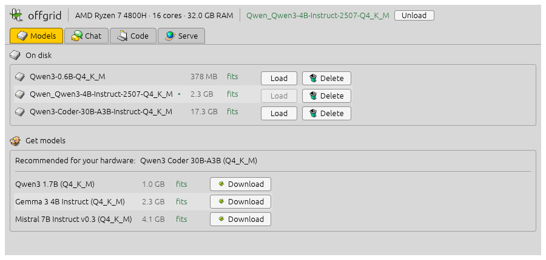

# offgrid



A self-contained, fully local LLM prepper tool. One binary: browse and download
GGUF models from Hugging Face, see which ones fit your hardware, chat with them
offline, and expose them to other tools over an OpenAI-compatible API.

No model server, no cloud, no accounts. Once a model is downloaded, everything
works without internet.

## Features

- **Models tab** — curated starter catalog (verified known-good chat models)
  plus full Hugging Face GGUF search. Every model gets a fit badge
  (`fits` / `tight` / `too big`) based on your RAM, and the app recommends the
  best model for your hardware. Download with progress, load, delete.
- **Chat tab** — streaming chat with the loaded model, runs on llama.cpp
  (statically linked via `llama-cpp-2`), CPU inference.
- **Code tab** — a simple local coding agent: point it at a workspace folder,
  give it a task, and the loaded model works with tools (`list_files`,
  `read_file`, `write_file`, `run_command`) in a Claude Code-like loop. File
  access is sandboxed to the workspace; shell commands need per-command
  approval unless auto-approve is enabled. Drop an `AGENTS.md` in the
  workspace root to give the agent project instructions. Optional web tools
  (`web_search` via DuckDuckGo Lite with a Wikipedia fallback, plus
  `fetch_url`) are off by default and degrade gracefully offline: failures
  come back to the model as a short "web unavailable" note so the run
  continues on local knowledge instead of hanging. Works best with
  Qwen3 4B or larger; run `offgrid --smoke-agent` for a headless check.
- **Serve tab** — optional OpenAI-compatible server on `127.0.0.1:11633`
  (`/v1/models`, `/v1/chat/completions` with SSE streaming) so tools like
  opencode, aider, or editor plugins can use your local models. Includes a
  ready-to-copy `opencode.json` provider snippet.

Models are stored in `~/.local/share/offgrid/models/`, config in
`~/.config/offgrid/`.

## Build

Requires a C/C++ toolchain and CMake (llama.cpp is compiled in):

```sh
sudo apt install build-essential cmake   # debian/ubuntu
cargo run --release
```

Use `--release` — CPU inference in debug builds is much slower.

## Headless smoke test

```sh
cargo run --release -- --smoke
```

Downloads the smallest catalog model if needed, runs one generation, then
serves the API until Ctrl+C.

## UI snapshot test

The screenshot above is generated by an [egui_kittest](https://crates.io/crates/egui_kittest)
snapshot test that renders the main screen offscreen and compares it against
`tests/snapshots/offgrid.png`. After intentional UI changes, refresh the
baseline (and the README image) with:

```sh
UPDATE_SNAPSHOTS=1 cargo test main_screen_snapshot
cp tests/snapshots/offgrid.png assets/screenshot.png
```

## Notes

- Reasoning models (e.g. Qwen3) may show raw `<think>…</think>` blocks in
  responses; append `/no_think` to your message to disable that on Qwen3.
- The context window is fixed at 4096 tokens; clear the chat if it fills up.

## Roadmap

- GPU offload (`llama-cpp-2` vulkan/cuda features + VRAM-aware recommendations)
- Persistent conversations
- Agent: edit/patch tool, diff view, multi-task memory
